# FinSkalp OS — Transformation Audit & Unified Roadmap

**Version:** 1.0  
**Status:** MANDATORY — supersedes fragmented implementation notes  
**Date:** 2026-07-11  
**Rule:** DO NOT CODE until Steps 1–4 are reviewed and Phase scope approved.

---

## 0. Unified Constitution (MASTER-PROMPT 001–007 merged)

Single operating model — not seven separate specs:

| Pillar | Principle |
|--------|-----------|
| **Product identity** | Financial Intelligence Operating System — not dashboard, AML portal, or React app |
| **Graph as OS** | Graph is desktop, investigation, and entry point; 60–70% viewport; never reloads, evolves live |
| **Mission Control** | Login → active operation: Queue \| Live Graph \| Intelligence Officer \| Bottom dock (Timeline, Evidence, Blockchain, Reports, Tasks) |
| **Intelligence Officer** | Continuous observer/recommender — not chatbot, not floating assistant |
| **Interaction** | Keyboard-first (Bloomberg); mouse secondary; command palette (Ctrl+K) replaces menus |
| **Panels** | Dockable, floatable, resizable, multi-monitor, persisted — Figma-grade workspace |
| **Synchronization** | Graph ↔ Timeline ↔ Evidence ↔ Reports ↔ AI — one object, many views; context never lost |
| **Density** | 80–90% operational pixels; no KPI cards, no dead tabs, no modal-heavy UX |
| **Visual language** | `#0B1118` void, `#17222E` panels, semantic color only; Palantir/Bloomberg density, original identity |
| **Motion** | State communication only (expansion, risk propagation, flow, replay) — no decorative animation |
| **Backend** | RFC modules, APIs, investigation engine, reports — **immutable**; all UX changes additive |
| **Quality gate** | Every change must answer: *Does this make investigation faster?* |

---

## 1. Repository map (as-is)

### 1.1 Three operator surfaces

| Surface | URL | Role | Constitution compliance |
|---------|-----|------|-------------------------|
| **Enterprise app** | `:5173` | JWT, production API `:5001` | **Partial** — Fusion routes exist; graph is ReactFlow not GPU OS |
| **Demo stand** | `:8877` | Integration demo, rich ops UX | **Partial** — `fusion-os.css` shell; alt views still legacy forms |
| **API** | `:5001` | Compliance, graph, inbox, SSE, reports | **Strong** — backend is the asset |

### 1.2 Frontend architecture (`flowsint-app`)

```
routes/
  index.tsx → /dashboard/fusion
  _auth.dashboard.tsx → ALL /dashboard/* bypass RootLayout (Fusion OS)
  _auth.dashboard.fusion.tsx → Mission Control
  _auth.dashboard.fusion.investigation.$caseRef.tsx → Investigation workspace
  _auth.dashboard.{tools,vault,profile,flows,custom-types,enrichers} → FusionPlatformShell
  _auth.dashboard.investigations.* → LEGACY investigation routes (still exist)
  _auth.dashboard.compliance.tsx → redirect to fusion

fusion/ (27 files) — NEW design system shell
  FusionShell, FusionRail, FusionGraphStage, FusionMIO, FusionDock, FusionKeyboard, FusionCommandPalette
  tokens.css, panels.css, motion.css, typography.css

components/compliance/
  compliance-graph-view.tsx — ReactFlow + dagre (@legacy enhanced)
  compliance-service.ts — API client (KEEP)
  scalpel-console-page.tsx — tools (still uses --fs-* tokens)

components/layout/
  root.layout.tsx, sidebar.tsx, top-navbar.tsx, page-layout.tsx — LEGACY SaaS (bypassed on dashboard)

components/chat/floating-chat.tsx — VIOLATION (chatbot pattern)

hooks/use-compliance-events.ts + api/sse.ts — SSE live feed (KEEP, extend)
```

### 1.3 Backend & RFC (KEEP)

- **Platform v2:** blockchain, ICF, CRIF, RDE, ECCF, EIA, ASPP, ESA, IDOO, EGPR
- **Reports:** screening, SAR, forensic, seizure — WORKS
- **Graph API:** `GET /api/compliance/cases/{id}/graph` — evidence graph JSON
- **Workflow:** inbox, transitions, recommendations, queue-order, analyst workspace state
- **SSE:** operator events stream (partial EIA SSE gap on backend)

Reference: `docs/audit/enterprise-gap-report.md`, `flowsint-crypto-compliance/docs/rfc/`

### 1.4 Demo stand (`flowsint-crypto-compliance/demo/static`)

- `fusion-os.css` + rebuilt `index.html` — Mission Control shell
- `graph-viz.js` — Sigma/force-graph (richer than app ReactFlow)
- `app.js` — loadDashboard, deck graph, MIO, dock tabs
- Alt views (`viewWallet`, `viewOsint`, etc.) — **still form/page layouts**

---

## 2. Constitution violation inventory

### P0 — Blocks "Intelligence OS" recognition

| ID | Violation | Location | Constitution section |
|----|-----------|----------|---------------------|
| V-01 | Graph is ReactFlow widget, not GPU OS | `compliance-graph-view.tsx` | Graph IS OS, GPU 100k+ nodes |
| V-02 | Graph remounts on case switch / tab change | fusion routes | Live graph never reloads |
| V-03 | No timeline→graph replay sync | investigation dock | §7 Everything synchronized |
| V-04 | No money-flow animation | graph layer | §6 Money flow engine |
| V-05 | FloatingChat still in codebase | `floating-chat.tsx`, `_auth.dashboard.tsx` | §AI — no chatbot |
| V-06 | Legacy investigation routes coexist | `/dashboard/investigations/*` | No pages — mission only |
| V-07 | Demo alt-views are form pages | `:8877` wallet/osint views | No forms in workspace |
| V-08 | Dual token systems `--fs-*` + `--fusion-*` | styles.css, enterprise-ui, sidebar | Single canonical DS |
| V-09 | Graph node shapes generic circles | ReactFlow default | Unique glyphs per entity type |
| V-10 | Keyboard spec ~20% implemented | FusionKeyboard vs §2 spec | Keyboard primary |

### P1 — Enterprise feeling gaps

| ID | Violation | Location |
|----|-----------|----------|
| V-11 | Inspector panel not slide-from-right contextual | graph click → partial |
| V-12 | Evidence drag-to-graph connect | not implemented |
| V-13 | Alert grouping/dedup/spam control | feed lists raw |
| V-14 | Failure states generic | error boundaries |
| V-15 | Presentation/Executive mode | not implemented |
| V-16 | Multi-monitor float/detach | partial (localStorage layout only) |
| V-17 | Collaboration cursors | not implemented |
| V-18 | Global Intelligence Search Ctrl+Shift+F | not implemented |
| V-19 | ALT+1..6 panel focus shortcuts | not implemented |
| V-20 | Camera physics (smooth fly-to) | ReactFlow fitView only |

### P2 — Cleanup / consistency

| ID | Violation | Location |
|----|-----------|----------|
| V-21 | `MetricsGrid`, case-overview legacy components | `components/dashboard/investigation/` |
| V-22 | `scalpel-console-page` uses PageLayout patterns | tools route |
| V-23 | Flow Architect / Schema Architect still SaaS list pages | flows, custom-types |
| V-24 | Login not v3 operator entry | `login.tsx` |
| V-25 | `--fs-*` in 10+ component files | grep `--fs-` |

---

## 3. Dependency graph (implementation order)

```mermaid
flowchart TB
  subgraph KEEP["Immutable foundation"]
    API[compliance-service.ts]
    RFC[Platform v2 RFC modules]
    RPT[Report engine]
    SSE[SSE / operator events]
  end

  subgraph P1["Phase 1 — Foundation DONE/PARTIAL"]
    TOK[fusion/tokens.css v3]
    SHELL[FusionShell + Rail]
    MC[Mission Control layout]
    CP[Ctrl+K palette partial]
    DEMO[fusion-os.css demo shell]
  end

  subgraph P2["Phase 2 — Graph OS"]
    GPersist[Graph persistence layer]
    SYNC[Timeline↔Graph↔Evidence sync]
    INS[Entity Inspector drawer]
    LIVE[SSE→graph pulse animation]
    KEYS[Full keyboard map]
  end

  subgraph P3["Phase 3 — Graph engine"]
    WEBGL[WebGL graph backend]
    GLYPH[Entity glyph system]
    FLOW[Money flow particles]
    CAM[Camera fly-to engine]
  end

  subgraph P4["Phase 4 — Intelligence Officer"]
    MIO[MIO continuous stream]
    REC[Recommendation auto-execute]
    HYP[Hypothesis strip]
  end

  subgraph P5["Phase 5 — Workspace"]
    FLOAT[Float/detach panels]
    MULTI[Multi-monitor profiles]
    MODE[Operation modes]
  end

  subgraph P6["Phase 6 — Legacy sunset"]
    DEL[Delete --fs-* / old routes]
    CHAT[Remove FloatingChat]
    LEG[Redirect investigations/*]
  end

  subgraph P7["Phase 7 — Executive + Collab"]
    CINE[Cinematic mode]
    CUR[Live cursors]
  end

  KEEP --> P1
  P1 --> P2
  P2 --> P3
  P3 --> P4
  P4 --> P5
  P5 --> P6
  P6 --> P7
```



**Critical path:** P2 (sync + persistence) before P3 (GPU engine). Backend APIs already support graph, timeline, recommendations, workspace state.

---

## 4. Migration roadmap (12 steps — directive aligned)

| Step | Task | Violations addressed | Deployable? |
|------|------|---------------------|-------------|
| **1** | ✅ Audit (this document) | — | Yes |
| **2** | Unified design tokens only (`--fusion-*`); deprecate `--fs-*` | V-08, V-25 | Yes |
| **3** | Mission Control graph 67% + bottom dock wired to real APIs | V-02 partial | Yes |
| **4** | Investigation: persistent graph + inspector drawer + sync bus | V-02, V-03, V-11 | Yes |
| **5** | Full keyboard map (§2 spec) + command palette actions | V-10, V-18, V-19 | Yes |
| **6** | Remove FloatingChat; MIO only | V-05 | Yes |
| **7** | Redirect/kill legacy `/investigations/*` routes | V-06 | Yes |
| **8** | Demo: all views inside fusion shell; forms → drawers | V-07 | Yes |
| **9** | Entity glyphs + layer toggles on ReactFlow (interim) | V-09 | Yes |
| **10** | WebGL graph engine behind feature flag | V-01, V-04 | Yes |
| **11** | Executive presentation mode | V-15 | Yes |
| **12** | Collaboration + multi-monitor float | V-16, V-17 | Yes |

---

## 5. What exists vs constitution (scorecard)

| Criterion | Target | Current | Gap |
|-----------|--------|---------|-----|
| Visual identity | 10/10 | 4/10 | Demo/app still mixed legacy |
| Information density | 10/10 | 5/10 | Platform routes sparse |
| Graph as OS | 10/10 | 3/10 | Widget, not desktop |
| Keyboard-first | 10/10 | 3/10 | ~6 shortcuts vs 20+ |
| Live updates | 10/10 | 6/10 | SSE feed yes; graph pulse no |
| AI Officer | 10/10 | 5/10 | MIO cards yes; not continuous |
| Panel docking | 10/10 | 7/10 | Resizable yes; float partial |
| Sync (graph↔timeline) | 10/10 | 2/10 | Mostly independent panels |
| Performance (100k nodes) | 10/10 | 2/10 | ReactFlow ~500 practical |
| Unrecognizable from old UI | Yes | No | User confirmed |

---

## 6. Recommended next implementation batch (when approved)

**Batch A — Perception shift (1–2 days, no backend changes):**
1. Investigation route: graph default 70%, inspector slide panel, timeline scrub highlights nodes
2. Implement keyboard §2 (SPACE pause, ALT+1..6, CTRL+G, CTRL+F graph search)
3. Remove FloatingChat from all paths
4. Migrate `--fs-*` consumers in fusion paths to `--fusion-*`
5. Demo wallet/osint → drawer panels inside fusion shell

**Batch B — Graph OS core (1–2 weeks):**
1. Graph persistence store (no remount on navigation)
2. SSE event → graph animation pipeline
3. Entity glyph nodes (wallet hex, person round, etc.)
4. Global intelligence search (Ctrl+Shift+F)

**Batch C — Engine (quarter):**
1. WebGL graph (sigma.js v2 or custom) behind `FUSION_GPU_GRAPH` flag
2. Money flow layer
3. Cinematic executive mode

---

## 7. Files to touch (when coding starts)

| Priority | Paths |
|----------|-------|
| P0 | `fusion/FusionKeyboard.tsx`, `fusion.investigation.$caseRef.tsx`, `compliance-graph-view.tsx` |
| P0 | `fusion/FusionInspector.tsx` (new), `fusion/fusion-sync-bus.ts` (new) |
| P1 | `demo/static/index.html`, `demo/static/js/app.js`, `demo/static/css/fusion-os.css` |
| P1 | `_auth.dashboard.investigations.*` → redirects |
| P2 | `components/chat/floating-chat.tsx` → delete |
| P2 | `design-system/tokens.css`, `styles.css` → merge into fusion tokens |

---

## 8. Absolute rules (repeated for implementers)

- **Never** rewrite backend, RFC modules, report engine, investigation logic
- **Never** break API contracts in `compliance-service.ts`
- **Every** PR passes: *Does this feel like analytical equipment, not a website?*
- **Incremental** — each batch leaves platform deployable

---

*Next action: User approves Batch A scope → implement without subagent fragmentation unless requested.*
