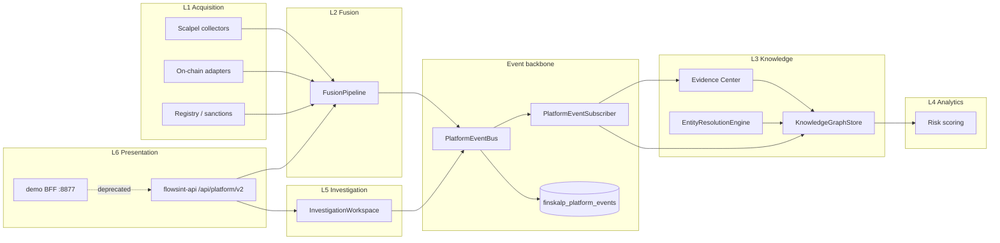

# Data flow map — RFC-0002 Platform v2

## End-to-end investigation flow



## Write paths

| Source | Legacy store | v2 canonical | Event |
|--------|--------------|--------------|-------|
| `persist_osint_finding` | `osint_findings` | `finskalp_evidence` (dual-write) | — |
| `FinSkalpInvestigator` | investigation cache | `finskalp_entities` | `CaseOpened`, `RiskUpdated`, fusion stages |
| `ComplianceService.create_case` | `compliance_cases` | case Entity | `CaseOpened` |
| Scalpel collect | — | entities + evidence | `OsintMentionFound` |
| Analyst confirm/reject | `compliance_entity_labels` | wallet Entity attrs | `ReviewSubmitted` |
| `PlatformEventBus.publish` | Redis `finskalp:events:v2` | `finskalp_platform_events` | all |

## Read paths (CQRS)

| Endpoint | Source |
|----------|--------|
| `GET /api/platform/v2/cases/{case_ref}/timeline` | `finskalp_platform_events` |
| `GET /api/platform/v2/architecture` | plugin registry + schema manifest |
| Investigation UI graph | Neo4j `Finskalp*` labels (unified projection) |

## Package map

```
platform/v2/
  canonical.py          # Entity, Evidence
  events.py             # PlatformEvent catalog
  event_bus.py          # publish → Redis + Postgres + subscriber
  event_subscriber.py   # knowledge projection handlers
  evidence_center.py    # OsintFinding → finskalp_evidence
  entity_resolution.py  # signal → Entity merge
  knowledge_store.py    # Postgres upsert
  investigation_workspace.py  # Case bridge
  neo4j_projection.py   # unified graph labels
  fusion_pipeline.py    # L2 stages
  plugin_registry.py    # Scalpel factories
  gateway.py            # shared handlers
```
